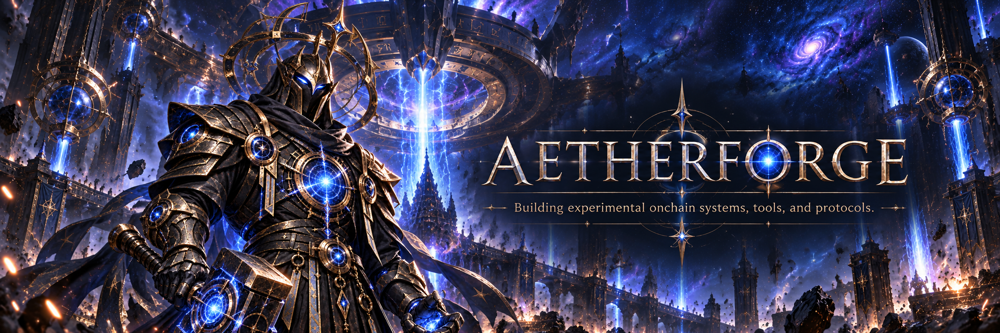

<div align="center">

# AETHERFORGE



<br><br>


<br><br>


&nbsp;&nbsp;&nbsp;

&nbsp;&nbsp;&nbsp;

&nbsp;&nbsp;&nbsp;


<br><br>

**Building experimental onchain systems, tools, and protocols.**

</div>

---

### About

Aetherforge is a builder collective focused on infrastructure, markets, and experimental crypto products.

---

### Areas of Interest

- Onchain infrastructure
- Protocol design
- Market primitives
- Developer tooling
- Experimental consumer crypto products

---

### Current Direction

```text
forge/
├── research
├── protocols
├── tooling
└── experiments
